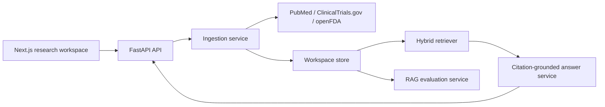

# TrialLens Architecture

## System Shape

TrialLens is organized around research workspaces. A workspace has a condition, optional intervention, normalized evidence sources, chunks, question answers, and evaluation results.

## MVP Storage

The MVP uses a JSON-backed repository to keep local setup simple. The schema mirrors the planned database entities:

- workspaces
- evidence sources
- chunks
- answers
- retrieval traces
- briefs
- eval summaries

The intended production upgrade is PostgreSQL plus pgvector:

- relational tables for workspaces, sources, chunks, answers, and model/eval runs
- `vector` column on chunks
- GIN indexes for keyword retrieval
- vector indexes for semantic retrieval

## RAG Contract

The frontend does not know whether retrieval uses local embeddings, pgvector, Qdrant, or hosted embeddings. It depends only on these backend contracts:

- create workspace
- ingest evidence
- list sources
- ask question
- inspect retrievals
- generate brief
- view evals

## Safety Positioning

TrialLens is not a diagnosis or treatment recommender. It separates evidence source types and explicitly labels FDA adverse events as reports rather than proof of causality.

